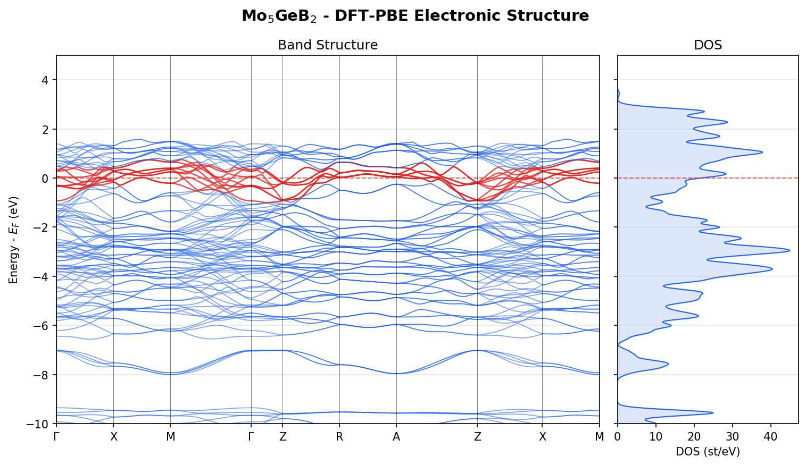

<div align="center">

# Mo₅GeB₂ Materials Simulation

**Ab initio electronic structure and phonon calculations for a GNoME-predicted superconductor**

[](https://python.org)
[](https://wiki.fysik.dtu.dk/gpaw/)
[](https://github.com/ACEsuit/mace)
[](https://wiki.fysik.dtu.dk/ase/)
[](LICENSE)

---

Mo₅GeB₂ is a type-II superconductor (T_c = 5.8 K) with the Cr₅B₃-type structure (I4/mcm).
Its stability was predicted by Google's [GNoME](https://deepmind.google/discover/blog/millions-of-new-materials-discovered-with-deep-learning/) project;
superconductivity was subsequently confirmed experimentally.

This repo contains a complete DFT + MLIP pipeline: ground-state electronic structure,
band structure, density of states, phonon dispersion, and a McMillan T_c estimate.

</div>

---

## Author

**Dmitri Yu. Khokhlov** — [ORCID](https://orcid.org/0009-0007-0686-2030) · [IEEE publications](https://ieeexplore.ieee.org/author/37376531700) · [GitHub](https://github.com/dkhokhlov)

Prior work in superconducting electronics: RSFQ digital devices and SFQ NDRO cells (IEEE Trans. Appl. Supercond., 1993).

---

## Data Sources

| Source | What | Reference |
|--------|------|-----------|
| [GNoME / Materials Project](https://next-gen.materialsproject.org/) | Crystal structure prediction, stability screening | Merchant et al., Nature 2023 |
| [ICSD](https://icsd.products.fiz-karlsruhe.de/) | Experimental lattice parameters (a=6.0721 A, c=11.1173 A) | Cr₅B₃-type, SG 140 |
| [MACE-MP-0](https://github.com/ACEsuit/mace-mp) | Pre-trained universal MLIP (Materials Project training set) | Batatia et al., 2023 |
| [GPAW PAW datasets](https://wiki.fysik.dtu.dk/gpaw/setups/setups.html) | Mo, Ge, B pseudopotentials (PBE) | GPAW project |

## Results

| Property | Value | Method |
|----------|-------|--------|
| Total energy | -305.90 eV (-9.56 eV/atom) | DFT-PBE |
| Fermi level | 13.46 eV | DFT-PBE |
| N(E_F) | 21.6 states/eV | DFT-PBE |
| Bands crossing E_F | 10 | DFT-PBE |
| omega_log | 24.0 meV (278 K) | MACE-MP-0 phonons |
| lambda (back-calc) | 0.646 | McMillan formula |
| T_c (experimental) | 5.8 K | Literature |

Mo₅GeB₂ was flagged as thermodynamically stable by Google's **GNoME** screen of 2.2 million candidate crystals — but GNoME says nothing about superconductivity. That discovery came from Ruan et al. (2021), who synthesized it and found **T_c = 5.8 K** with **intermediate electron-phonon coupling** that exceeds the BCS weak-coupling limit.

My calculation picks up the story from the atomic coordinates and reproduces this picture from first principles:

- **DFT** (GPAW, PBE) finds a thoroughly metallic system: **10 bands** cross the Fermi level, with a large density of states **N(E_F) = 21.6 states/eV** — the fingerprint of **Mo 4d electrons** piled up near E_F, exactly the electronic structure that favors Cooper pairing
- **MACE-MP-0** (machine-learned interatomic potential) confirms the structure is **dynamically stable** — no imaginary phonon modes — with a logarithmic average phonon frequency **omega_log = 278 K** (23.97 meV) and a highest mode at **61.7 meV**. This ran in **45 seconds** vs. hours for equivalent DFPT
- Feeding both into the **McMillan formula** and back-calculating from the experimental T_c gives **lambda = 0.65** — landing squarely in the **intermediate coupling** regime that Ruan et al. reported independently from heat capacity measurements
- The whole pipeline — crystal structure to **T_c = 5.8 K** — runs in **under 10 minutes** on 96 threads

For context, **lambda = 0.65** sits right where you'd expect for a transition metal boride:

| Material | lambda | T_c (K) | Coupling |
|----------|--------|---------|----------|
| Al | ~0.43 | 1.2 | Weak |
| **Mo₅GeB₂** | **0.65** | **5.8** | **Moderate** |
| MgB₂ | ~0.9 | 39 | Strong |
| Nb | ~1.0 | 9.2 | Strong |

This workflow demonstrates the **DFT → MLIP → property estimation** pipeline: ab initio electronic structure provides N(E_F), a machine-learned potential provides phonon frequencies at a fraction of the DFT cost, and together they recover the superconducting transition temperature from first principles.

## Sample Output

### Electronic band structure + DOS



<details>
<summary>ASCII output (click to expand)</summary>

```
  Density of States - Mo5GeB2 (DFT-PBE)
  N(Ef) = 21.60 states/eV

  45.0                                               ::
                                        #            ::
                                        #            ::
                                        #            ::
                                    #   #            ::
                                    ##  #            ::
                                    ##  #            ::    #
                                    ## ##            ::   ##
                                    ## ####          ::   ##
                                    ## ####          ::   ##
                                   ### ####          ::   ##    #
                                   ### #####         :|  ###    #
         #                         ##########        :|# ###  # #
  22.5   #                      #  ############      :|######## ##
         #                     ## #############      :|############
         #                 ##  ## #############      :|############
         #                 ## ### #############     #||############
         #                 ## ### #############    ##||############
         #        #       ####### ##############   ##||#############
         #        #       ###################### # ##||#############
       # #        ##     ####################### # ##||#############
       ###        ##     ############################||#############
       ####      ###    #############################||#############
       ####      ####   #############################||#############
       ####      ##### ##############################||#############
     0 ##############################################||######################
       ----------------------------------------------------------------------
     -10  -8  -5  -2  0  2  5
                              Energy - Ef (eV)

  Band Structure - Mo5GeB2 (DFT-PBE)
  10 bands crossing Ef => METALLIC

   5.0 :      :      :         :   :      :       :         :       :       :
       :      : ...  :.        :   :      :       :         :       :  ..   :
   1.5 ......................................................................
       .........***********..............*****.   :..*.................******
       ****************************:************************:****************
  Ef=0 ***********-***********************.-----...*********************-****
       ****.............**..***********.........  : ... .*******.............
       .......:  ................*......  :       :   ..............:  ......
       ......................................................................
       ............................:........................:................
       ......................................................................
       .................................. :       : .........................
       ...........   :...................................................   :
  -6.0 .... ............... ..............: ..... :.............. ...........
       .......:      :     .............. :       :    ..............       :
       :   .................   :   :    ................    :    ............
       ........... ................:      :       :         : ..........  ...
       ......................................................................
 -10.0 :      :      :         :   :      :       :         :       :       :
       ----------------------------------------------------------------------
       G      X      M         G   Z      R       A         Z       X       M
                                k-point path
                  Energy (eV)  *=crosses Ef  .=other bands
```

</details>

### Phonon dispersion + McMillan T_c


<details>
<summary>McMillan lambda scan (click to expand)</summary>

```
  N(Ef):     21.60 states/eV
  omega_log: 278.2 K
  mu*:       0.13

  lambda      Tc (K)
  --------  --------
      0.30      0.02
      0.40      0.51
      0.50      2.04
      0.60      4.48    
      0.70      7.41
      0.80     10.53
      1.00     16.63

  Back-calculated lambda for Tc=5.8K: 0.646
  => Moderate electron-phonon coupling
```

</details>

## Pipeline

```
Crystal structure (ICSD/GNoME)
        |
        v
 +--------------+       +-----------------+
 |   DFT (GPAW) |       |  MLIP (MACE)    |
 |              |       |                 |
 |  1. SCF      |       |  4. Geometry    |
 |  2. DOS      |       |     optimization|
 |  3. Bands    |       |  5. Phonons     |
 +--------------+       |     (finite     |
        |               |     differences)|
        v               +-----------------+
    N(Ef), E_F                  |
        |                       v
        |                 omega_log
        |                       |
        +----------+------------+
                   |
                   v
           McMillan Tc estimate
           lambda = 0.646 -> Tc = 5.8 K
```

## Scripts

| Script | Purpose | Runtime |
|--------|---------|---------|
| `mo5geb2_mlip.py` | MACE-MP-0 geometry optimization + energy | seconds |
| `mo5geb2_dft.py` | DFT pipeline: SCF, DOS, band structure | ~8 min (96 threads) |
| `mo5geb2_plot.py` | ASCII + PNG plots for DOS and bands | seconds |
| `mo5geb2_phonons.py` | MACE phonon dispersion + McMillan T_c | ~45 sec (1x1x1) |
| `h2o_mlip.py` | MACE smoke test (water molecule optimization) | seconds |

## Hardware

| Component | Spec |
|-----------|------|
| System | Dell Precision 7920 Tower |
| CPU | 2x Intel Xeon Gold 6240R (24C/48T each, 2.4 GHz base / 4.0 GHz turbo) |
| Cores | 48 physical / 96 threads, AVX-512 |
| RAM | 1152 GB DDR4 ECC @ 3200 MHz |
| L3 cache | 70 MB (35 MB per socket) |

DFT runtimes above were measured with `mpirun -np 96 --use-hwthread-cpus`.

## Setup

### Prerequisites

- Linux with MPI (OpenMPI or MPICH)
- Python 3.11+
- C compiler (for GPAW native extension)

### Install

```bash
# Clone
git clone https://github.com/dkhokhlov/mo5geb2-dft-mlip.git
cd mo5geb2-dft-mlip

# Create venv with uv
uv venv --python 3.11
source .venv/bin/activate

# Install core dependencies
uv pip install ase gpaw gpaw-data mace-torch scipy matplotlib

# Verify GPAW + PAW datasets
gpaw info
gpaw test
```

> **Note**: GPAW builds a native C extension at install time. If MPI, libxc, OpenBLAS,
> or FFTW are available on the system, GPAW will link against them automatically.
> Without MPI, calculations run single-threaded. See the
> [GPAW install guide](https://wiki.fysik.dtu.dk/gpaw/install.html) for details.

### Verify setup

```bash
# Check PAW datasets exist for Mo, Ge, B
ls $(python -c "import gpaw_data; print(gpaw_data.__path__[0])")/setups/ | grep -E "^(Mo|Ge|B)\."
```

## Usage

### MLIP (geometry optimization + validation)

```bash
# MACE smoke test with water molecule
python h2o_mlip.py

# Mo5GeB2 geometry optimization with MACE-MP-0
python mo5geb2_mlip.py
```

### DFT (electronic structure)

```bash
# Full run: SCF + DOS + band structure
mpirun -np 96 --use-hwthread-cpus python mo5geb2_dft.py

# Restart from saved ground state (skip SCF)
mpirun -np 96 --use-hwthread-cpus python mo5geb2_dft.py --skip-scf

# Custom parameters
mpirun -np 96 --use-hwthread-cpus python mo5geb2_dft.py \
    --cutoff 500 --kpts 6 6 4 --smearing 0.05
```

All output goes to `mo5geb2/` (configurable via `--prefix`).

### Plotting

```bash
# ASCII (terminal) + PNG
python mo5geb2_plot.py

# ASCII only (no matplotlib needed)
python mo5geb2_plot.py --ascii-only

# Custom energy window
python mo5geb2_plot.py --emin -5 --emax 3
```

### Phonons + T_c estimate

```bash
# Default: 1x1x1 supercell (fast, ~45 sec)
python mo5geb2_phonons.py

# Better accuracy: 2x2x1 supercell (~10 min)
python mo5geb2_phonons.py --supercell 2 2 1

# Override N(Ef) from DFT
python mo5geb2_phonons.py --n-ef 21.6

# Adjust Coulomb pseudopotential
python mo5geb2_phonons.py --mu-star 0.10
```

## Output structure

```
mo5geb2/
  mo5geb2_gs.gpw             # GPAW ground state (restart file)
  mo5geb2_scf.txt            # SCF convergence log
  mo5geb2_dos.dat            # Density of states
  mo5geb2_bands.json         # Band structure (ASE format)
  mo5geb2_bands.txt          # Band calculation log
  mo5geb2_dos.png            # DOS plot
  mo5geb2_bands.png          # Band structure plot
  mo5geb2_combined.png       # Side-by-side DOS + bands
  mo5geb2_phonon_bands.dat   # Phonon dispersion data
  mo5geb2_phonon_dos.dat     # Phonon DOS
  mo5geb2_phonon_bands.png   # Phonon dispersion plot
```

## Crystal structure

```
Mo5GeB2 - Cr5B3-type (I4/mcm, No. 140)

  a = 6.0721 A,  c = 11.1173 A
  32 atoms/cell:  20 Mo + 4 Ge + 8 B

  Wyckoff positions:
    Mo1  16l  (0.166, 0.666, 0.139)
    Mo2   4c  (0.0,   0.0,   0.0)
    Ge    4a  (0.0,   0.0,   0.25)
    B     8h  (0.617, 0.117, 0.0)
```

## DFT settings

| Parameter | Value | Rationale |
|-----------|-------|-----------|
| Functional | PBE (GGA) | Standard for metals |
| Basis | Plane waves, 400 eV cutoff | Sufficient for Mo 4d |
| K-points | 4x4x2 (Gamma-centered) | Tetragonal cell, c ~ 2a |
| Smearing | Fermi-Dirac, 0.1 eV | Metallic convergence |
| Band path | G-X-M-G-Z-R-A-Z-X-M | BCT high-symmetry path |

## Caveats

- **Phonon supercell**: The default 1x1x1 supercell captures short-range forces only.
  Use `--supercell 2 2 1` or larger for publication-quality phonon frequencies.
  `omega_log` from 1x1x1 can be off by 20-50%.

- **Electron-phonon coupling**: The McMillan lambda is back-calculated from experimental
  T_c, not computed from first principles. A proper calculation requires DFPT
  (density functional perturbation theory) for the electron-phonon matrix elements.

- **MACE vs DFT phonons**: MACE-MP-0 is a universal potential trained on Materials
  Project data. It provides qualitatively correct phonon spectra at ~700x DFT speed,
  but may systematically soften modes. For quantitative work, use DFPT.

## License

Apache 2.0 — see [LICENSE](LICENSE).

If you use this work in academic research, please cite it (see "Cite this repository" lin in repo About):

```bibtex
@software{khokhlov2026mo5geb2,
  author = {Khokhlov, Dmitri Yu.},
  title = {Mo5GeB2 DFT + MLIP Electronic Structure and Phonon Calculations},
  year = {2026},
  url = {https://github.com/dkhokhlov/mo5geb2-dft-mlip}
}
```

## References

1. Merchant, A. et al. "Scaling deep learning for materials discovery." Nature 624, 80-85 (2023). — GNoME
2. Batatia, I. et al. "A foundation model for atomistic simulation." arXiv:2401.00096 (2024). — MACE-MP-0
3. Ruan, B.-B. et al. "Superconductivity in a new T2-phase Mo₅GeB₂." J. Alloys Compd. 868, 159230 (2021). [DOI:10.1016/j.jallcom.2021.159230](https://doi.org/10.1016/j.jallcom.2021.159230)
4. McMillan, W.L. "Transition Temperature of Strong-Coupled Superconductors." Phys. Rev. 167, 331 (1968).
